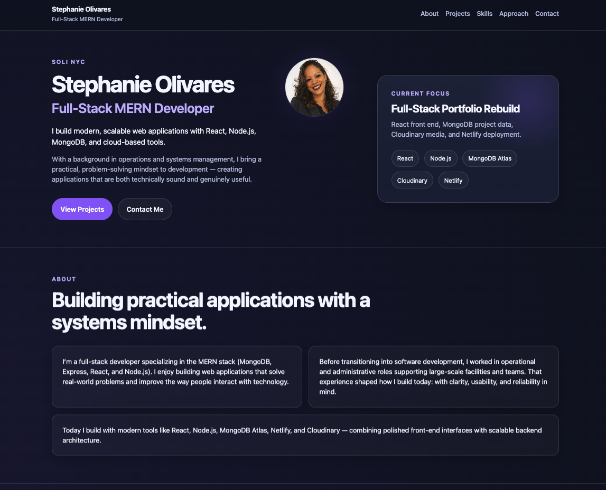
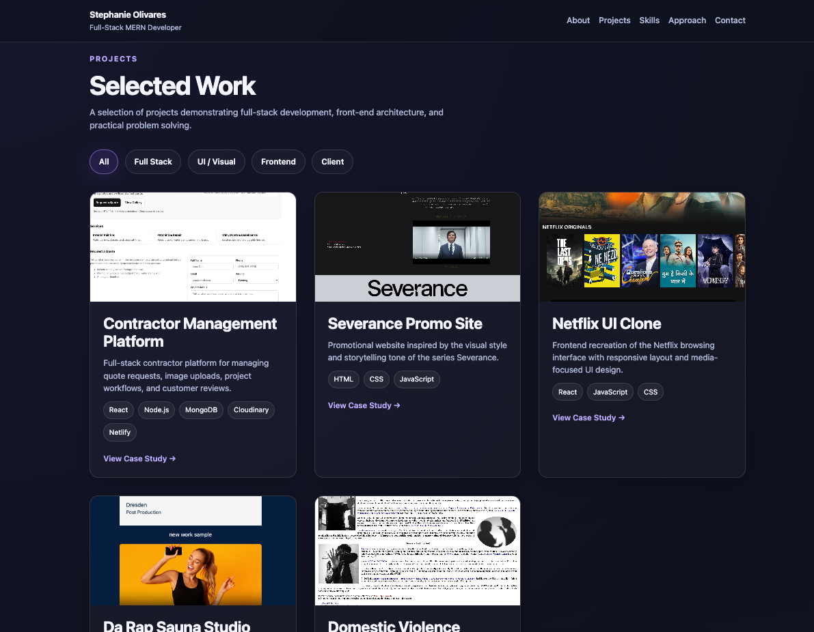
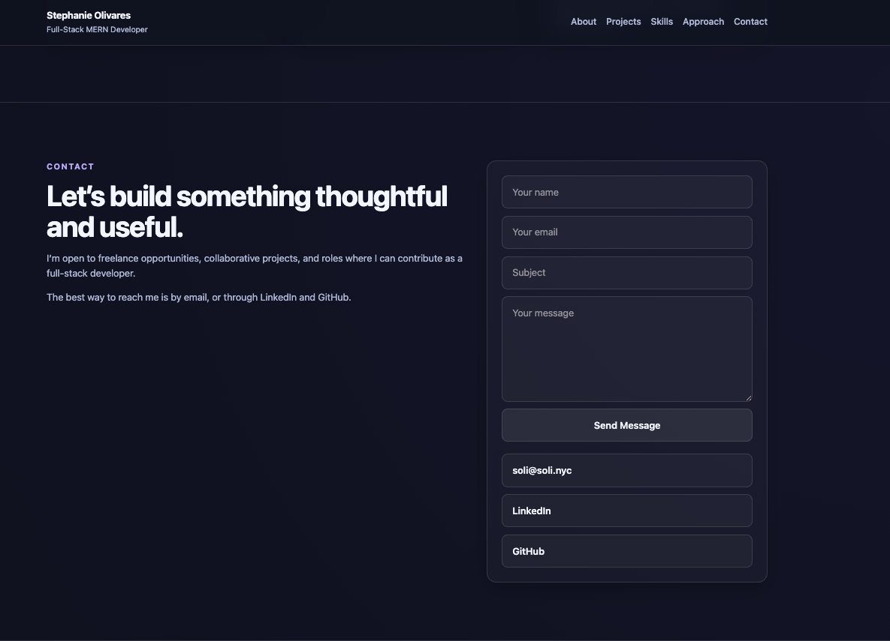

# Soli Portfolio — Full-Stack Developer Portfolio


A modern full-stack developer portfolio showcasing projects, technical skills, and a fully integrated backend contact system.

This project demonstrates **real-world full-stack architecture** using React, Node.js, Express, and MongoDB.

---

# 🚀 Live Portfolio

🌐 https://soli.nyc

---

# 📸 Screenshots

## Homepage



## Projects



## Contact System



---

# 🧰 Tech Stack

## Frontend

- React
- Vite
- CSS
- Responsive layout
- Component-based architecture

## Backend

- Node.js
- Express
- MongoDB Atlas
- Mongoose
- Nodemailer
- express-rate-limit
- CORS configuration
- Environment-based configuration

---

# ✨ Features

## Portfolio Website

- Responsive design
- Project showcase
- Skills and experience sections
- Smooth scrolling navigation
- Clean component architecture

---

## Production Contact System

The portfolio includes a **production-style backend contact system**.

Features include:

- React contact form with controlled inputs
- API requests using `fetch`
- Express backend API
- MongoDB message storage
- Email notifications via Nodemailer
- Rate limiting to prevent spam
- Secure CORS configuration
- Environment variable configuration
- Production deployment compatibility

Messages are both:

- Stored in MongoDB
- Delivered via email notification

---

# 🏗 Architecture

The portfolio uses a **decoupled frontend/backend architecture**.

User
│
▼
React Frontend (Vite)
│
▼
Express API (Node.js)
│
├── MongoDB Atlas (store messages)
└── Nodemailer (send email notification)

## Contact Flow

User
↓
React Contact Form
↓
Express API
↓
MongoDB Atlas (store message)

- Nodemailer (email notification)

    ***

# 📁 Project Structure

soli-portfolio-fullstack
│
├── portfolio-backend
│ ├── config
│ │ └── db.js
│ │
│ ├── controllers
│ │ └── contactController.js
│ │
│ ├── models
│ │ └── Contact.js
│ │
│ ├── routes
│ │ └── contactRoutes.js
│ │
│ └── server.js
│
└── soli-portfolio
├── src
├── public
└── vite.config.js

---

# ⚙️ Environment Variables

## Backend (.env)

PORT=3001

MONGODB_URI=your_mongodb_connection_string

EMAIL_HOST=smtp.gmail.com
EMAIL_PORT=587
EMAIL_USER=your_email
EMAIL_PASS=your_app_password
EMAIL_TO=your_email

CLIENT_URL=http://localhost:5173

## Frontend (.env)

VITE_API_URL=http://localhost:3001

---

# 💻 Running Locally

## 1. Clone the Repository

git clone https://github.com/OlivaresStephanie-FS/soli-portfolio-fullstack.git

cd soli-portfolio-fullstack

## 2. Start Backend

cd portfolio-backend
npm install
npm run dev

Backend runs at:

http://localhost:3001

## 3. Start Frontend

Open a new terminal:

cd soli-portfolio
npm install
npm run dev

Frontend runs at:

http://localhost:5173

---

# 🔒 Security Features

- API rate limiting
- Environment variable protection
- CORS configuration
- MongoDB Atlas connection security
- Secrets excluded from Git

---

# 📬 Contact

📧 soli@soli.nyc  
🔗 LinkedIn: https://www.linkedin.com/in/solinyc  
💻 GitHub: https://github.com/OlivaresStephanie-FS

---

# 👩‍💻 Author

**Stephanie Olivares**

Full-Stack MERN Developer focused on building scalable web applications and real-world business systems.
README 2 — Contractor Platform

# Manny’s Painting Company — Contractor Quote & Review Platform

A production-grade contractor operations platform that allows customers to request service quotes, upload project photos, and submit post-job reviews — while providing contractors with a secure admin dashboard to manage leads and customer feedback.

The platform replaces manual contractor workflows (phone calls, emails, spreadsheets) with a **structured digital pipeline for lead intake, job tracking, and reputation management**.

Built using a **modern serverless architecture** with Netlify Functions, MongoDB Atlas, and Cloudinary.

---

# 🚀 Live Platform

https://mannyspaintingcompany.com

---

# 🧰 Tech Stack

## Frontend

- React (Vite)
- React Router
- Component-driven architecture
- Responsive UI

## Backend

- Netlify Functions (serverless Node.js)
- MongoDB Atlas
- JWT authentication

## Infrastructure

- Cloudinary (secure image uploads)
- Nodemailer (SMTP email notifications)
- Netlify environment variables
- Netlify secrets scanning

---

# ✨ Core Features

## Quote Request System

Customers can submit painting project requests including:

- Contact information
- Service type
- Project description
- Photo uploads

Images upload securely through **Cloudinary signed uploads**, while quote data is stored in **MongoDB Atlas**.

After submission:

- Admin notification email is sent
- Optional client confirmation email is sent

---

# 🧑‍💼 Admin Quote Dashboard

Route:

/admin

Features:

- Secure JWT authentication
- Pagination for large datasets
- Image preview thumbnails
- Quote lifecycle management

Quote statuses:

new
contacted
scheduled
completed
archived

All updates are validated server-side and persisted to MongoDB.

---

# ⭐ Customer Review System

After a job is completed, customers can submit a review through a secure link.

Route:

/review/:quoteId

Review fields:

- 1–5 star rating
- Optional text feedback
- Optional name
- Associated service type

New reviews default to:

status: "pending"

---

# 🛡 Review Moderation

Admins moderate reviews through:

/admin/reviews

Moderation states:

pending
approved
rejected

Approved reviews appear on the public reviews page.

---

# 🌍 Public Reviews Page

Route:

/reviews

Displays approved customer reviews including:

- Star rating
- Review text
- Customer name
- Service type
- Submission date

Data is served through a **cached Netlify function** for performance.

---

# 🏗 Architecture Overview

React Frontend
│
▼
Netlify Functions (Serverless API)
│
▼
MongoDB Atlas
│
├── quotes collection
└── reviews collection

Image uploads are handled through **Cloudinary signed uploads**.

Admin operations are protected using **JWT authentication**.

---

# 🔐 Security Model

Admin endpoints require a JWT token.

Authorization: Bearer <JWT>

Tokens are issued by the admin login function and verified using:

ADMIN_JWT_SECRET

Security protections include:

- Server-side validation
- JWT verification
- Netlify environment variables
- Secrets scanning
- `.env` excluded from Git

---

# 📁 Project Structure

mannyspaintcompany
│
├── netlify
│ └── functions
│ ├── quote.js
│ ├── public-submit-review.js
│ ├── public-reviews.js
│ ├── admin-login.js
│ ├── admin-quotes.js
│ ├── admin-reviews.js
│ ├── admin-update-quote-status.js
│ ├── admin-update-review-status.js
│ └── cloudinary-sign.js
│
├── src
│ ├── components
│ │ ├── Navbar.jsx
│ │ ├── Footer.jsx
│ │ └── Review.jsx
│ │
│ ├── pages
│ │ ├── Home.jsx
│ │ ├── Gallery.jsx
│ │ ├── Reviews.jsx
│ │ ├── AdminLogin.jsx
│ │ ├── AdminQuotes.jsx
│ │ └── AdminReviews.jsx
│ │
│ ├── lib
│ │ └── adminAuth.js
│ │
│ ├── App.jsx
│ └── main.jsx
│
├── netlify.toml
├── package.json
└── vite.config.js

---

# 💻 Local Development

Run the Netlify development server:

netlify dev --functions netlify/functions

Application runs at:

http://localhost:8888

---

# ⚙️ Environment Variables

Required production variables include:

MONGODB_URI
MONGODB_DB

CLOUDINARY_CLOUD_NAME
CLOUDINARY_API_KEY
CLOUDINARY_API_SECRET
CLOUDINARY_FOLDER

ADMIN_USERNAME
ADMIN_PASSWORD_HASH
ADMIN_JWT_SECRET

SMTP_HOST
SMTP_PORT
SMTP_USER
SMTP_PASS

ADMIN_NOTIFY_EMAILS
CLIENT_CONFIRM_ENABLED
CLIENT_CONFIRM_SUBJECT

REVIEW_TOKEN_SECRET
REVIEW_TOKEN_TTL_DAYS
PUBLIC_SITE_URL

---

# 🚀 Deployment

Hosted on **Netlify using serverless functions**.

Deployment pipeline includes:

- Automatic builds from GitHub
- Environment variable management
- Secrets scanning protection
- HTTPS enabled by default

---

# 👩‍💻 Author

**Stephanie Olivares**

Full-Stack Developer building real-world operational platforms using modern serverless architecture.

✅ These will paste cleanly into GitHub.

If you want, the next thing we should add (this is what makes your repos look senior) is:

Architecture diagrams

Admin dashboard screenshots

Case study sections

Those three things make hiring managers stop scrolling.

ur still breaking the files. if you break it again im going to end this chat and come back later because ur making this chat unnecessarily heavy.

Understood.

Here are 2 plain README.md files only. No extra formatting, no inserted IDs, no mixed content.

Portfolio README.md

# Soli Portfolio — Full-Stack Developer Portfolio


A modern full-stack developer portfolio showcasing projects, technical skills, and a fully integrated backend contact system.

This project demonstrates **real-world full-stack architecture** using React, Node.js, Express, and MongoDB.

---

## 🚀 Live Portfolio

🌐 https://soli.nyc

---

## 📸 Screenshots

### Homepage


### Projects


### Contact System


---

## 🧰 Tech Stack

### Frontend

- React
- Vite
- CSS
- Responsive layout
- Component-based architecture

### Backend

- Node.js
- Express
- MongoDB Atlas
- Mongoose
- Nodemailer
- express-rate-limit
- CORS
- Environment-based configuration

---

## ✨ Features

### Portfolio Website

- Responsive design
- Project showcase
- Skills and experience sections
- Smooth scrolling navigation
- Clean component architecture

### Production Contact System

The portfolio includes a production-style backend contact system.

Features include:

- React contact form with controlled inputs
- API requests using `fetch`
- Express backend API
- MongoDB message storage
- Email notifications via Nodemailer
- Rate limiting to prevent spam
- Secure CORS configuration
- Environment variable configuration
- Production deployment support

Messages are both:

- Stored in MongoDB
- Delivered via email notification

---

## 🏗 Architecture

The portfolio uses a decoupled frontend/backend architecture.

```text
User
 │
 ▼
React Frontend (Vite)
 │
 ▼
Express API (Node.js)
 │
 ├── MongoDB Atlas (store messages)
 └── Nodemailer (send email notification)
Contact Flow
User
 ↓
React Contact Form
 ↓
Express API
 ↓
MongoDB Atlas (store message)
 +
Nodemailer (email notification)
📁 Project Structure
soli-portfolio-fullstack
│
├── portfolio-backend
│   ├── config
│   │   └── db.js
│   ├── controllers
│   │   └── contactController.js
│   ├── models
│   │   └── Contact.js
│   ├── routes
│   │   └── contactRoutes.js
│   └── server.js
│
└── soli-portfolio
    ├── src
    ├── public
    └── vite.config.js
⚙️ Environment Variables
Backend (.env)
PORT=3001

MONGODB_URI=your_mongodb_connection_string

EMAIL_HOST=smtp.gmail.com
EMAIL_PORT=587
EMAIL_USER=your_email
EMAIL_PASS=your_app_password
EMAIL_TO=your_email

CLIENT_URL=http://localhost:5173
Frontend (.env)
VITE_API_URL=http://localhost:3001
💻 Running Locally
1. Clone the Repository
git clone https://github.com/OlivaresStephanie-FS/soli-portfolio-fullstack.git
cd soli-portfolio-fullstack
2. Start Backend
cd portfolio-backend
npm install
npm run dev

Backend runs at:

http://localhost:3001
3. Start Frontend

Open a new terminal:

cd soli-portfolio
npm install
npm run dev

Frontend runs at:

http://localhost:5173
🔒 Security Features

API rate limiting

Environment variable protection

CORS configuration

MongoDB Atlas connection security

Secrets excluded from Git

📬 Contact

📧 soli@soli.nyc

🔗 LinkedIn: https://www.linkedin.com/in/solinyc

💻 GitHub: https://github.com/OlivaresStephanie-FS

👩‍💻 Author

Stephanie Olivares

Full-Stack MERN Developer focused on building scalable web applications and real-world business systems.
```
