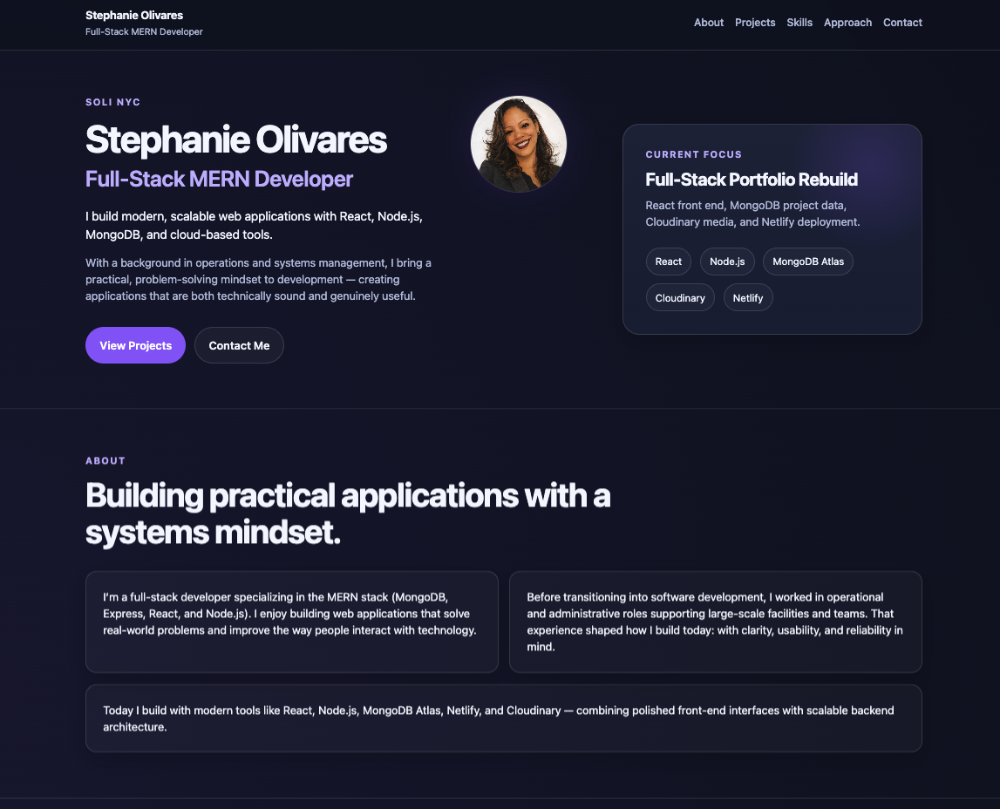
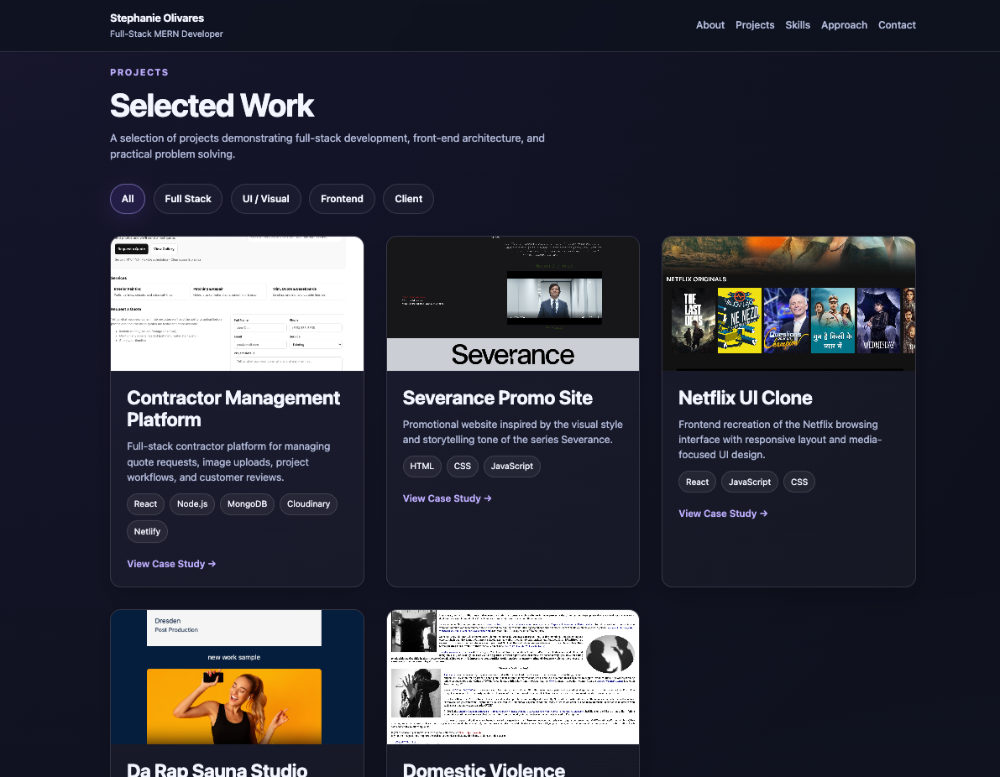
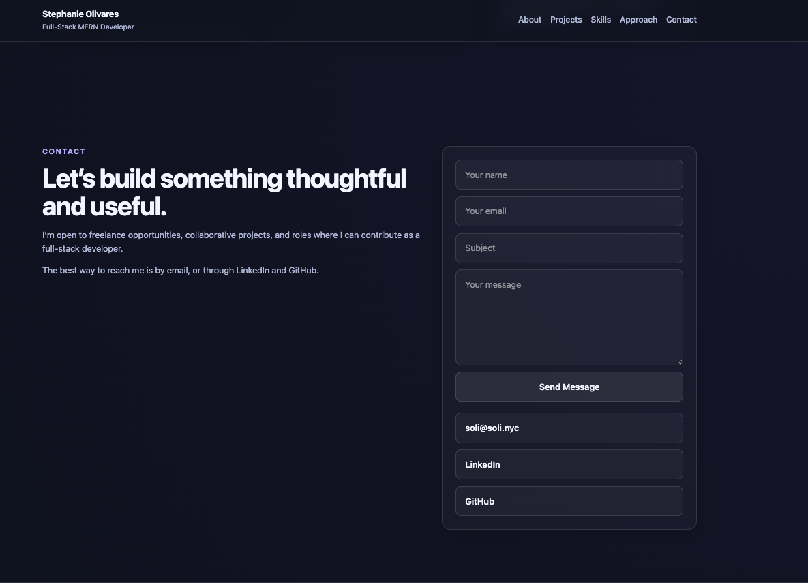

# Soli Portfolio — Full-Stack Developer Portfolio

A modern full-stack developer portfolio showcasing projects, technical skills, and a fully integrated backend contact system.

This project demonstrates **real-world full-stack architecture** using React, Node.js, Express, and MongoDB.

---

# 🚀 Live Portfolio

🌐 https://soli.nyc

---

# 📸 Screenshots

## Homepage

## Projects

## Contact System

---

# 🧰 Tech Stack

## Frontend

- React
- Vite
- CSS
- Responsive layout
- Component-based architecture

## Backend

- Node.js
- Express
- MongoDB Atlas
- Mongoose
- Nodemailer
- express-rate-limit
- CORS configuration
- Environment-based configuration

---

# ✨ Features

## Portfolio Website

- Responsive design
- Project showcase
- Skills and experience sections
- Smooth scrolling navigation
- Clean component architecture

---

## Production Contact System

The portfolio includes a **production-style backend contact system**.

Features include:

- React contact form with controlled inputs
- API requests using `fetch`
- Express backend API
- MongoDB message storage
- Email notifications via Nodemailer
- Rate limiting to prevent spam
- Secure CORS configuration
- Environment variable configuration
- Production deployment compatibility

Messages are both:

- Stored in MongoDB
- Delivered via email notification

---

# 🏗 Architecture

The portfolio uses a **decoupled frontend/backend architecture**.

User
│
▼
React Frontend (Vite)
│
▼
Express API (Node.js)
│
├── MongoDB Atlas (store messages)
└── Nodemailer (send email notification)

## Contact Flow

User
↓
React Contact Form
↓
Express API
↓
MongoDB Atlas (store message)

- Nodemailer (email notification)

    ***

# 📁 Project Structure

soli-portfolio-fullstack
│
├── portfolio-backend
│ ├── config
│ │ └── db.js
│ │
│ ├── controllers
│ │ └── contactController.js
│ │
│ ├── models
│ │ └── Contact.js
│ │
│ ├── routes
│ │ └── contactRoutes.js
│ │
│ └── server.js
│
└── soli-portfolio
├── src
├── public
└── vite.config.js

---

# ⚙️ Environment Variables

## Backend (.env)

PORT=3001

MONGODB_URI=your_mongodb_connection_string

EMAIL_HOST=smtp.gmail.com
EMAIL_PORT=587
EMAIL_USER=your_email
EMAIL_PASS=your_app_password
EMAIL_TO=your_email

CLIENT_URL=http://localhost:5173

## Frontend (.env)

VITE_API_URL=http://localhost:3001

---

# 💻 Running Locally

## 1. Clone the Repository

git clone https://github.com/OlivaresStephanie-FS/soli-portfolio-fullstack.git

cd soli-portfolio-fullstack

## 2. Start Backend

cd portfolio-backend
npm install
npm run dev

Backend runs at:

http://localhost:3001

## 3. Start Frontend

Open a new terminal:

cd soli-portfolio
npm install
npm run dev

Frontend runs at:

http://localhost:5173

---

# 🔒 Security Features

- API rate limiting
- Environment variable protection
- CORS configuration
- MongoDB Atlas connection security
- Secrets excluded from Git

---

# 📬 Contact

📧 soli@soli.nyc  
🔗 LinkedIn: https://www.linkedin.com/in/solinyc  
💻 GitHub: https://github.com/OlivaresStephanie-FS

---

# 👩‍💻 Author

**Stephanie Olivares**

Full-Stack MERN Developer focused on building scalable web applications and real-world business systems.
